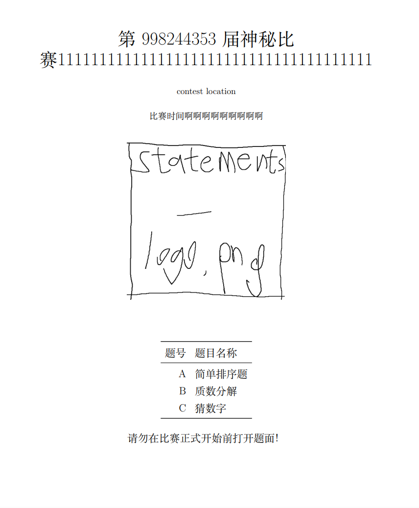
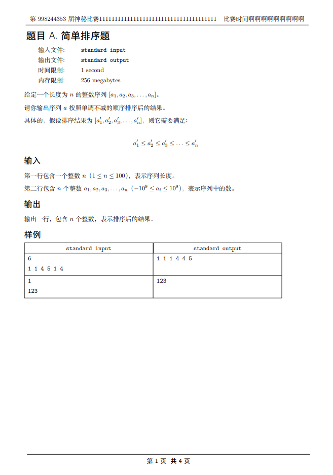
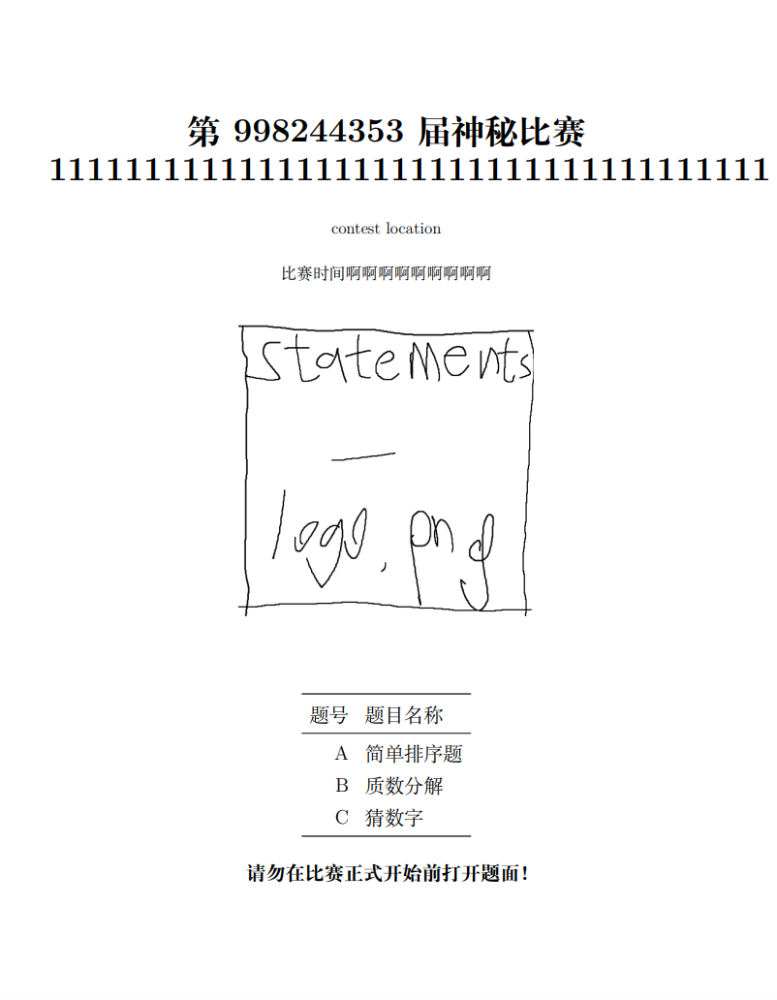
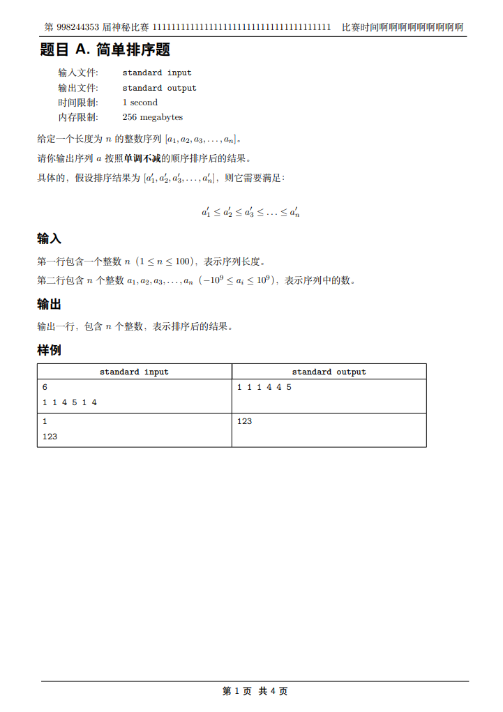

# polygon-chinese-template

修改自 [fstqwq/polygon-chinese-template](https://github.com/fstqwq/polygon-chinese-template)

### Usage

替换比赛中的 `olymp.sty`, `statement.ftl` 文件即可。

### Features

- 提供了一个简易的 toc。使用示例见 `statement.ftl` 文件中的相关被注释部分。



- 更改了页眉格式



### Note

建议将 package 从 polygon 上下载下来后，在本地使用 XeLaTeX 进行构建，从而取得更好的效果。

具体的，在 package 中找到 `statements/语言/doall.sh`

将其中

```sh
latex statements.tex
latex statements.tex
dvips statements.dvi
dvipdfmx -p a4 statements.dvi
rm -f *.log
rm -f *.aux
rm -f *.dvi
rm -f *.ps
```

替换为

```sh
xelatex -synctex=1 -interaction=nonstopmode statements.tex
xelatex -synctex=1 -interaction=nonstopmode statements.tex
```

之后运行此处的 `doall.sh` 即可。

效果：




